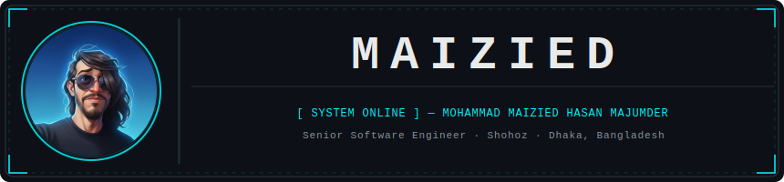

<!-- HEADER BANNER -->
<div align="center">




[](https://www.linkedin.com/in/maizied/)
[](https://github.com/Maijied)
[](https://github.com/Maijied)

</div>

---

## ◈ IDENTITY MATRIX

```yaml
DESIGNATION  : Mohammad Maizied Hasan Majumder
ALIAS        : Maijied
ROLE         : Senior Software Engineer @ Shohoz
LOCATION     : Dhaka, Bangladesh
FOLLOWERS    : 2K+
MISSION      : Analytical, detail-oriented developer with stellar communication skills.
               Building scalable applications across web, mobile, game, and IoT domains.
STATUS       : [ ACTIVE ]
```

---

## ◈ TECH STACK — CORE MODULES

<div align="center">

### Languages


### Frameworks & Platforms


### Databases & Tools


</div>

---

## ◈ GITHUB TELEMETRY

<div align="center">


</div>

<div align="center">


</div>

---

## ◈ PROJECT ARCHIVES — MISSION LOG

> Spanning game engines, mobile platforms, web systems, IoT hardware, and AI experiments.

---

### 🌍 OPEN SOURCE SECTOR

| Project | Links | Description |
|---------|-------|-------------|
| [🎵 Lorapok Media Player](https://github.com/Maijied/Lorapok_Media_Player) | [🌐 Web](https://maijied.github.io/Lorapok_Media_Player/) · [📦 npm](https://www.npmjs.com/package/lorapok-player) · [🐧 Snap](https://snapcraft.io/lorapokmediaplayer) · [⚙️ CI/CD](https://github.com/Maijied/Lorapok_Media_Player/blob/main/.github/workflows/workflow-unified.yml) | Cross-platform media player (Web, Windows, Mac, Linux Snap). Complex multi-target engineering workflow. |
| [🤖 Lorapok AI Agent](https://github.com/Maijied/Lorapok_AI_Agent) | [GitHub](https://github.com/Maijied/Lorapok_AI_Agent) | AI coding agent — currently in active development |
| [🃏 Hazari Scoreboard](https://github.com/Maijied/Hazari_Scoreboard) | [🌐 Live](https://maijied.github.io/Hazari_Scoreboard/) | Card game scoreboard tracker |
| [📊 Lorapok — Laravel Execution Monitor](https://github.com/Maijied/lorapok) | [🌐 Web](https://maijied.github.io/lorapok/) · [📦 Packagist](https://packagist.org/packages/lorapok/laravel-execution-monitor) | Laravel package for real-time execution monitoring |
| [🎟️ Spotlight Tickets](https://github.com/Maijied/spotlight-tickets) | [GitHub](https://github.com/Maijied/spotlight-tickets) | Self-hosted ticket selling platform |
| [⬇️ XSnap Media Downloader](https://github.com/Maijied/xsnap-media-downloader_Opera) | [GitHub](https://github.com/Maijied/xsnap-media-downloader_Opera) | Opera & Mozilla browser addon for media downloading |
| [🔤 SubtitleMaster — Chrome](https://github.com/Maijied/SubtitleMaster-Chrome) | [GitHub](https://github.com/Maijied/SubtitleMaster-Chrome) | Subtitle downloader extension for Chrome |
| [🔤 SubtitleMaster — Firefox](https://github.com/Maijied/SubtitleMaster-Firefox) | [🦊 AMO](https://addons.mozilla.org/en-US/firefox/addon/subtitle-master/) | Subtitle downloader extension for Firefox |
| [🐧 Linux File Replacer](https://github.com/Maijied/Linux-File-Replacer) | [GitHub](https://github.com/Maijied/Linux-File-Replacer) | Linux file replacement utility application |
| [📝 Linpad](https://github.com/Maijied/linpad) | [🌐 Web](https://maijied.github.io/linpad/) | Lightweight Ubuntu notepad with syntax highlighting |
| [🪟 Lorapok Windows Activator](https://github.com/Maijied/Lorapok-Windows-Activator) | [🌐 Web](https://maijied.github.io/Lorapok-Windows-Activator/) | Windows activation utility |
| [⌨️ Lorapok Keyboard](https://github.com/Maijied/Lorapok-Keyboard) | [🌐 Web](https://maijied.github.io/Lorapok-Keyboard/) | Bangla NLP AI-based keyboard |
| [🔄 Lorapok LocalSync](https://github.com/Maijied/Lorapok-LocalSync) | [🌐 Web](https://maijied.github.io/Lorapok-LocalSync/) | Local file sync utility |
| [💬 Lorapok Dynamic Ollama LLM Chat](https://github.com/Maijied/Lorapok-Dynamic-Ollama-LLM-Chat-Interface) | [🌐 Web](https://maijied.github.io/Lorapok-Dynamic-Ollama-LLM-Chat-Interface/) | Dynamic chat interface for local Ollama LLM models |
| [🔍 Love and Lust — Investigation](https://github.com/Maijied/Love-and-lust) | [🌐 Web](https://maijied.github.io/Love-and-lust/) | Investigation/research project |
| [🔥 Roast as a Service](https://github.com/Maijied/roast-as-a-service) | [🌐 Web](https://maijied.github.io/roast-as-a-service/) · [📦 npm](https://www.npmjs.com/package/roast-api) · [🐍 PyPI](https://pypi.org/project/roast-api/) · [📦 Packagist](https://packagist.org/packages/maizied/roast-api) | Multi-platform roast API (npm, PyPI, Packagist) |

---

### 🎮 GAME DEVELOPMENT SECTOR

| Project | Tech | Stars | Description |
|---------|------|-------|-------------|
| [🕹️ AirHockey Unity3D Android Game](https://github.com/Maijied/AirHockey_Unity3D_AndroidGame) | C#, Unity3D, Blender | ⭐ 10 | Single & multiplayer Air Hockey for Android |
| [✈️ Flying Plane 3D Unity Game](https://github.com/Maijied/FlyingPlane3d_UnityGameProject) | C#, Unity3D | ⭐ 4 | First 3D game project — flight simulation |
| [🌴 Jungle Boy — Android & VR](https://github.com/Maijied/Jungle-Boy-Game-For-Android-and-VR-Unity3D-Game-Engine-) | C#, Unity3D | ⭐ 5 | Cross-platform Android & VR game |
| [🎯 Catch The Balls](https://github.com/Maijied/Catch-The-Balls-Android-Studio-Project) | Java, Android Studio | ⭐ 2 | Mini Android arcade game |

---

### 📱 MOBILE DEVELOPMENT SECTOR

| Project | Tech | Stars | Description |
|---------|------|-------|-------------|
| [🤖 Bangla Character Recognition](https://github.com/Maijied/Bangla-Character-Recognition-Android-application) | Android, ML | ⭐ 1 | AI-powered Bangla OCR Android app |
| [🔍 Augmented Reality Object Detection](https://github.com/Maijied/Augmented-Reality-Based-Object-Detection) | C#, AR, Unity | ⭐ 1 | AR-based real-time object detection |
| [📊 Android Quiz App](https://github.com/Maijied/Android-Quiz-App) | Java, Android | ⭐ 1 | Interactive quiz application |
| [🗄️ Android MySQL CRUD](https://github.com/Maijied/Android-Studio-Mysql-CRUD-Operation) | Java, MySQL | ⭐ 2 | Full CRUD operations with MySQL backend |
| [💰 Expense Manager Pro](https://github.com/Maijied/ExpenseManagerPro) | Java, Android | ⭐ 2 | Personal finance tracker |
| [⚙️ Expense Manager Engine](https://github.com/Maijied/ExpenseManagerEngine) | Java | ⭐ 2 | Core engine for expense management |

---

### 🌐 WEB DEVELOPMENT SECTOR

| Project | Tech | Stars | Description |
|---------|------|-------|-------------|
| [🎓 Academic Dept. Management System](https://github.com/Maijied/Academic_Department_Management_System_Using_Laravel) | PHP, Laravel | ⭐ 3 | Full academic department management |
| [👶 Children Education Web System](https://github.com/Maijied/Children-Education-Web-System) | PHP | ⭐ 1 | Web-based children's learning platform |
| [🔗 Full-Stack Node+React+MySQL](https://github.com/Maijied/Full-Stack-Web-Development-Using-Node-Express-Mysql-React) | Node.js, Express, React, MySQL | ⭐ 2 | Complete full-stack web application |
| [🏢 Company Portfolio](https://github.com/Maijied/company_portfolio) | CSS, HTML | ⭐ 0 | [Live Demo](https://company-portfolio-theta.vercel.app) |
| [📝 JS Text Editor](https://github.com/Maijied/JS-Text-Editor) | JavaScript | ⭐ 2 | Browser-based text editor |
| [🔢 React Redux Counter](https://github.com/Maijied/fluffy-giggle) | React, Redux | ⭐ 2 | [Live Demo](https://react-redux-counter-ten.vercel.app) |
| [🐘 fragmento-de-sudo](https://github.com/Maijied/fragmento-de-sudo) | PHP | ⭐ 2 | PHP web project |
| [📡 CCTV Streaming API](https://github.com/Maijied/CCTV_Streaming_API) | JavaScript | ⭐ 2 | Real-time CCTV stream API |
| [🃏 Hazari Scoreboard](https://github.com/Maijied/Hazari_Scoreboard) | HTML | ⭐ 0 | Card game scoreboard tracker |

---

### 🤖 AI / EXPERIMENTAL SECTOR

| Project | Tech | Stars | Description |
|---------|------|-------|-------------|
| [🧠 Larapok AI Coding Agent Test](https://github.com/Maijied/Larapok_AI_Coding_Agent_Test) | JavaScript | ⭐ 0 | Experimental AI coding agent integration |
| [🔬 Bangla Character Recognition](https://github.com/Maijied/Bangla-Character-Recognition-Android-application) | Android, ML | ⭐ 1 | Neural network-based Bangla OCR |
| [👁️ AR Object Detection](https://github.com/Maijied/Augmented-Reality-Based-Object-Detection) | C#, AR | ⭐ 1 | Augmented reality + computer vision |

---

### ⚡ IoT / HARDWARE SECTOR

| Project | Tech | Stars | Description |
|---------|------|-------|-------------|
| [🔦 Arduino Gear Motor + Laser Sensor](https://github.com/Maijied/Arduino-gear-motor-stoping-mechanism-by-Photo-Resistor-Module-and-Laser-sensor) | Arduino, C++ | ⭐ 3 | Motor stop mechanism via photo resistor & laser |

---

### 🛠️ TOOLS & UTILITIES

| Project | Tech | Stars | Description |
|---------|------|-------|-------------|
| [📝 Linpad Text Editor](https://github.com/Maijied/linpad) | Python | ⭐ 8 | Lightweight Ubuntu text editor with syntax highlighting |
| [📚 Eloquent JS Practice](https://github.com/Maijied/Eloquent-Javascript-Practice) | JavaScript | ⭐ 2 | JavaScript deep-dive exercises |
| [🎯 DSA Interview Challenges](https://github.com/Maijied/dsa-interview-challenges) | JavaScript | ⭐ 0 | Curated DSA problems for interviews |
| [🌍 B2G Demo Project](https://github.com/Maijied/B2GDemoProject) | Java | ⭐ 3 | Business-to-government demo system |

---

## ◈ EXPERIENCE LOG

```
┌─────────────────────────────────────────────────────────────────┐
│  CURRENT MISSION                                                │
│  ─────────────────────────────────────────────────────────────  │
│  Organization : Shohoz                                          │
│  Role         : Senior Software Engineer                        │
│  Location     : Dhaka, Bangladesh                               │
│  Status       : [ ACTIVE ]                                      │
└─────────────────────────────────────────────────────────────────┘
```

---

## ◈ CERTIFICATIONS & CLEARANCES

```
[ CERT-001 ]  Productivity Management And Leadership
              Maslow Bangladesh · Aug 2022 · ID: 000439
```

---

## ◈ ACHIEVEMENTS — COMBAT RECORD

```
[ ACHIEVEMENT-001 ]  🥉 3rd Place — IUT Hackathon
                     Islamic University of Technology (IUT)
                     Competed against top engineering teams
                     and secured 3rd position.
```

---

## ◈ VOLUNTEER OPERATIONS

```
[ OP-001 ]  Seminar Organizer — "Career Development"
            CSE Society, SUST · Nov 2015 – Nov 2019 (4 years)
            National seminar hosted Nov 7–10 annually.

[ OP-002 ]  Open Source Contributor — Mozilla Firefox Localization
            Mozilla Firefox Help · Mar 2012 – Jan 2018 (5 years 11 months)
            Contributed to Firefox community localization project.
```

---

## ◈ EDUCATION

```
[ EDU-001 ]  B.Sc. in Computer Science & Engineering
             Shahjalal University of Science and Technology (SUST)
             Sylhet, Bangladesh
```

---

## ◈ AI FEATURES — LIVE WIDGETS

<div align="center">

### Contribution Activity Map


</div>

---

## ◈ SIGNAL CHANNELS

<div align="center">

[](https://www.linkedin.com/in/maizied/)
[](https://github.com/Maijied?tab=repositories)

</div>

---

<div align="center">

```
╔══════════════════════════════════════════════════════╗
║   "Code is the language of the future.               ║
║    Every line written is a step toward it."          ║
║                          — Maizied                   ║
╚══════════════════════════════════════════════════════╝
```


</div>
