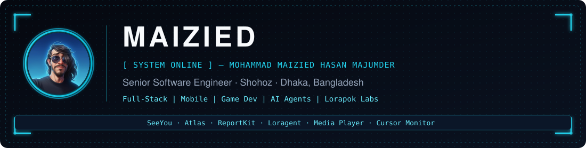

  

  
  
  
  
  
  

---

## Profile

**Mohammad Maizied Hasan Majumder** (`@Maijied`) is a Senior Software Engineer at [Shohoz](https://www.shohoz.com/) in Dhaka, Bangladesh, and the founder of [Lorapok Labs](https://lorapok.tech/). He holds a B.Sc. in Computer Science and Engineering from Shahjalal University of Science and Technology (SUST).

At Shohoz he works on backend and full-stack systems for national-scale bus, train, flight, and event booking. In parallel he designs, ships, and maintains 30+ public products across AI agents, developer tools, packages, media, and localization.

Previously: Software Engineer at Infinity Infotech Ltd and Turtle Solutions Limited. 3rd place, IUT Hackathon. Mozilla Firefox localization contributor (2012–2018). Seminar organizer, SUST CSE Society.

| | |
|---|---|
| **Now** | Senior Software Engineer, Shohoz · Dhaka |
| **Studio** | Founder & Principal Engineer, Lorapok Labs (2023–present) |
| **Education** | B.Sc. CSE, Shahjalal University of Science and Technology |
| **Focus** | Laravel, React, Node.js, Android, AI agents, DevOps |
| **Site** | [maizied.lorapok.tech](https://maizied.lorapok.tech/) · [SeeYou](https://seeyou.lorapok.tech/) |

---

## Stack

  
  
  
  
  
  
  
  
  
  
  
  

---

## Open source catalog

Auto-synced from GitHub (`Maijied` + `Lorapok`). Run `node scripts/sync-projects.mjs` or the `Sync README projects` Action to refresh.

<!-- PROJECTS:START -->
### Flagship — Lorapok Labs

| Project | Details | Links |
|---|---|---|
| **Lorapok Labs hub** · ⭐ 2 | Studio portal — Biological UI, product catalog, and Lorapok brand home. | [GitHub](https://github.com/Lorapok/lorapok.github.io) · [Live](https://lorapok.tech/) |
| **Lorapok Media Player** · ⭐ 1 | Cross-platform player for Web, Windows, macOS, and Linux Snap with sensory UI. | [GitHub](https://github.com/Maijied/Lorapok_Media_Player) · [Live](https://media.lorapok.tech/) |
| **Lorapok API Atlas** | Directory of 2,100+ public APIs with in-browser testing, AI assistant, npm, MCP, and VS Code extension. | [GitHub](https://github.com/Lorapok/Lorapok-API_Atlas) · [Live](https://atlas.lorapok.tech/) |
| **ReportKit** | Chunked, zero re-query PHP reporting stack for multi-DB Laravel workloads. | [GitHub](https://github.com/Maijied/Reportkit-Core) · [Live](https://reportkit.lorapok.tech/) |
| **SeeYou** | Agentic SEO specialist (iCanSeeYou) — remote MCP, API, dashboard, render-gap + AEO audits, ROI fix plans. | [GitHub](https://github.com/Lorapok/SeeYou) · [Live](https://seeyou.lorapok.tech/) |
| **Lorapok LocalSync** · ⭐ 1 | Lorapok LocalSync is a high-performance, privacy-focused communication platform designed to work exclusively on your local router’s network. No internet required, no external servers, just pure peer-to-peer and local-first interaction. | [GitHub](https://github.com/Maijied/Lorapok-LocalSync) · [Live](https://maijied.github.io/Lorapok-LocalSync/) |
| **Bab.La** | Bab.La (Greek for "All in One") is an open-source content broadcasting platform by Lorapok Labs. From a single composer, you post anything — text, images, videos, GIFs, links, files — to all your platforms simultaneously with one click. | [GitHub](https://github.com/Maijied/Bab.La) · [Live](https://maijied.github.io/Bab.La/) |
| **CLoraMF** | Lorapok smart  | [GitHub](https://github.com/Maijied/CLoraMF) · [Live](https://maijied.github.io/CLoraMF/) |
| **Intellij Lorapok** | Open-source project by Maijied / Lorapok Labs. | [GitHub](https://github.com/Maijied/Intellij-Lorapok) · [Live](https://maijied.github.io/Intellij-Lorapok/) |
| **Lorapok Labs Bible** | Open-source project by Maijied / Lorapok Labs. | [GitHub](https://github.com/Maijied/Lorapok-Labs-Bible) · [Live](https://maijied.github.io/Lorapok-Labs-Bible/) |
| **LoraPok LaraTest** | Automatically run Laravel tests whenever test files are modified across all Laravel versions | [GitHub](https://github.com/Maijied/LoraPok-LaraTest) · [Live](https://kirohub.dev/resource/kirohub-generate/lorapok-laratest) |
| **Lorapok Luvon** | Open-source project by Maijied / Lorapok Labs. | [GitHub](https://github.com/Maijied/Lorapok-Luvon) |
| **Lorapok MindNode** | Open-source project by Maijied / Lorapok Labs. | [GitHub](https://github.com/Maijied/Lorapok-MindNode) · [Live](https://maijied.github.io/Lorapok-MindNode/) |

### AI & agents

| Project | Details | Links |
|---|---|---|
| **Lorapok AI Agent** · ⭐ 1 | Autonomous coding agent for terminal and full-stack engineering. | [GitHub](https://github.com/Maijied/Lorapok_AI_Agent) · [Live](https://ai.lorapok.tech/) |
| **Loragent** | Multi-agent orchestration framework and AI marketplace. | [GitHub](https://github.com/Maijied/Loragent) · [Live](https://loragent.lorapok.tech/) |
| **Majhi GPT Chatbot AI Based on OPENAI ChatGPT using Vite** · ⭐ 5 | Open-source project by Maijied / Lorapok Labs. | [GitHub](https://github.com/Maijied/Majhi_GPT-Chatbot-AI-Based-on-OPENAI-ChatGPT-using-Vite) · [Live](https://majhi-gpt.vercel.app) |
| **SourceCodeOnlineJudgeFrontEnd** · ⭐ 4 | SourceCode Online Judge is developed by  Maizied Hasan Majumder, Dept. of Computer Science Engineering, Shahjalal University of Science & Technology. It is still under development and running in α version. This project still needs lots of improvement. Any suggestion will be appreciated. Happy Coding... | [GitHub](https://github.com/Maijied/SourceCodeOnlineJudgeFrontEnd) · [Live](https://onlinejudge-beta.vercel.app) |
| **Maijied** · ⭐ 3 | Open-source project by Maijied / Lorapok Labs. | [GitHub](https://github.com/Maijied/Maijied) · [Live](https://maijied.github.io/Maijied/) |
| **Maijied KaraokeAndroidAppDesign** · ⭐ 3 | Open-source project by Maijied / Lorapok Labs. | [GitHub](https://github.com/Maijied/Maijied-KaraokeAndroidAppDesign) |
| **maijied.github.io** · ⭐ 3 | Open-source project by Maijied / Lorapok Labs. | [GitHub](https://github.com/Maijied/maijied.github.io) · [Live](https://maijied.github.io/) |
| **Lorapok Dynamic Ollama LLM Chat Interface** · ⭐ 2 | This project provides a complete setup for running LLMs locally using Ollama, with a dynamic console interface similar to Gemini/Claude, web UI access via Open WebUI, VS Code integration, and API server capabilities.  | [GitHub](https://github.com/Maijied/Lorapok-Dynamic-Ollama-LLM-Chat-Interface) · [Live](https://maijied.github.io/Lorapok-Dynamic-Ollama-LLM-Chat-Interface/) |
| **Lorapok Windows Activator** · ⭐ 2 | Activate any edition of Windows 10 or 11 in under 60 seconds — no paid keys, no shady software, no subscriptions. | [GitHub](https://github.com/Maijied/Lorapok-Windows-Activator) · [Live](https://maijied.github.io/Lorapok-Windows-Activator/) |
| **MaijiedToon AnimationWork Using Blender** · ⭐ 2 | Open-source project by Maijied / Lorapok Labs. | [GitHub](https://github.com/Maijied/MaijiedToon_AnimationWork-Using_Blender) |
| **Larapok AI Coding Agent Test** · ⭐ 1 | Open-source project by Maijied / Lorapok Labs. | [GitHub](https://github.com/Maijied/Larapok_AI_Coding_Agent_Test) |
| **markopolo ai full stack challenge** · ⭐ 1 | Open-source project by Maijied / Lorapok Labs. | [GitHub](https://github.com/Maijied/markopolo-ai-full-stack-challenge) |
| **Lorapok Sorcerer** | Open-source project by Maijied / Lorapok Labs. | [GitHub](https://github.com/Maijied/Lorapok-Sorcerer) · [Live](https://maijied.github.io/Lorapok-Sorcerer/) |
| **Lorapok TabMan** | A high-performance Firefox tab manager for reclaiming memory and focus. Built by Lorapok Labs. | [GitHub](https://github.com/Maijied/Lorapok-TabMan) · [Live](https://maijied.github.io/Lorapok-TabMan/) |

### Developer tools

| Project | Details | Links |
|---|---|---|
| **AswitchI** | Launchpad-style app switcher for Ubuntu. | [GitHub](https://github.com/Maijied/AswitchI) · [Live](https://aswitchi.lorapok.tech/) |
| **Cursor Curse Monitor** | Live Cursor usage, budget, and billing dashboard. | [GitHub](https://github.com/Maijied/Cursor-Curse-Monitor-by-Lorapok) · [Live](https://cursor.lorapok.tech/) |
| **Linpad** · ⭐ 9 | Minimal Ubuntu editor with syntax highlighting. | [GitHub](https://github.com/Maijied/linpad) · [Live](https://maijied.github.io/linpad/) |
| **Spotlight Tickets** · ⭐ 1 | Self-hosted event ticketing platform. | [GitHub](https://github.com/Maijied/spotlight-tickets) |
| **Curse Monitor by Lorapok** | Curse Monitor by Lorapok — live Cursor usage CLI + Grok Bot plugin (quotas, bonus credits, Auto/API %, billing cycle) | [GitHub](https://github.com/Maijied/Curse-Monitor-by-Lorapok) · [Live](https://maijied.github.io/Curse-Monitor-by-Lorapok/) |
| **dCursor** | Open-source project by Maijied / Lorapok Labs. | [GitHub](https://github.com/Maijied/dCursor) |
| **Lorapok Git Geek** | Open-source project by Maijied / Lorapok Labs. | [GitHub](https://github.com/Maijied/Lorapok-Git-Geek) · [Live](https://maijied.github.io/Lorapok-Git-Geek) |
| **Lorapok Querycraft** | Open-source project by Maijied / Lorapok Labs. | [GitHub](https://github.com/Maijied/Lorapok-Querycraft) · [Live](https://maijied.github.io/Lorapok-Querycraft/) |
| **Reportkit Laravel** | Laravel 5.5–13 adapter for ReportKit (reportkit/laravel) | [GitHub](https://github.com/Maijied/Reportkit-Laravel) |
| **Reportkit Laravel Legacy** | Laravel 4.1–5.4 adapter for ReportKit (reportkit/laravel-legacy) | [GitHub](https://github.com/Maijied/Reportkit-Laravel-Legacy) |

### Packages & distribution

| Project | Details | Links |
|---|---|---|
| **Lorapok Keyboard** · ⭐ 1 | Android Bangla NLP keyboard with a 2.3M+ word vocabulary. | [GitHub](https://github.com/Maijied/Lorapok-Keyboard) · [Live](https://maijied.github.io/Lorapok-Keyboard/) |
| **Roast as a Service** | Humor API published on npm, PyPI, and Packagist. | [GitHub](https://github.com/Lorapok/roast-as-a-service) |
| **xsnap media downloader** · ⭐ 4 | Open-source project by Maijied / Lorapok Labs. | [GitHub](https://github.com/Maijied/xsnap-media-downloader) |
| **Lorapok Laravel Execution Monitor** · ⭐ 2 | Zero-Config Performance Monitoring for Laravel. | [GitHub](https://github.com/Maijied/Lorapok-Laravel-Execution-Monitor) · [Live](https://maijied.github.io/Lorapok-Laravel-Execution-Monitor/) |
| **SubtitleMaster Firefox** · ⭐ 2 | Subtitle Downloader Pro is a lightweight and efficient Chrome extension that lets you search and download subtitles instantly using the official OpenSubtitles API. | [GitHub](https://github.com/Maijied/SubtitleMaster-Firefox) |
| **SubtitleMaster Chrome** · ⭐ 1 | Subtitle Downloader Pro is a lightweight and efficient Chrome extension that lets you search and download subtitles instantly using the official OpenSubtitles API. | [GitHub](https://github.com/Maijied/SubtitleMaster-Chrome) |

### Games and earlier work

| Project | Details | Links |
|---|---|---|
| **Air Hockey** · ⭐ 11 | Single and multiplayer Unity air hockey for Android. | [GitHub](https://github.com/Maijied/AirHockey_Unity3D_AndroidGame) |
| **Jungle Boy Game For Android and VR Unity3D Game Engine ** · ⭐ 6 | Open-source project by Maijied / Lorapok Labs. | [GitHub](https://github.com/Maijied/Jungle-Boy-Game-For-Android-and-VR-Unity3D-Game-Engine-) |
| **FlyingPlane3d UnityGameProject** · ⭐ 5 | This is my first game project. Hope you'll enjoy the project. | [GitHub](https://github.com/Maijied/FlyingPlane3d_UnityGameProject) |
| **Catch The Balls Android Studio Project** · ⭐ 3 | A mini android game, made with android studio. | [GitHub](https://github.com/Maijied/Catch-The-Balls-Android-Studio-Project) |
| **Hazari Scoreboard** · ⭐ 1 | A modern, responsive, and animated web-based scoreboard for the Hazari card game. Built with a stunning "Glassmorphism" UI, this application allows you to track scores for 4 players with ease. | [GitHub](https://github.com/Maijied/Hazari_Scoreboard) · [Live](https://maijied.github.io/Hazari_Scoreboard/) |
| **Life vs Greed** · ⭐ 1 | Investigation site on Cox’s Bazar forest encroachment. | [GitHub](https://github.com/Maijied/Love-and-lust) · [Live](https://maijied.github.io/Love-and-lust/) |
| **Lorapok GameSpark** | Lorapok BrainSpark is a free, open-source daily brain training app built by Lorapok Labs. Three short daily games challenge your memory, pattern recognition, and vocabulary every day. | [GitHub](https://github.com/Maijied/Lorapok-GameSpark) · [Live](https://maijied.github.io/Lorapok-GameSpark/) |
| **Lorapok Red Bot** | AI-powered Reddit bot for moderation and developer community engagement (Ex..: r/LorapokLabs) | [GitHub](https://github.com/Maijied/Lorapok-Red-Bot) · [Live](https://maijied.github.io/Lorapok-Red-Bot/) |

### More repositories

| Project | Details | Links |
|---|---|---|
| **python django cookbook** · ⭐ 5 | Open-source project by Maijied / Lorapok Labs. | [GitHub](https://github.com/Maijied/python-django-cookbook) |
| **Academic Department Management System Using Laravel** · ⭐ 4 | Open-source project by Maijied / Lorapok Labs. | [GitHub](https://github.com/Maijied/Academic_Department_Management_System_Using_Laravel) |
| **Arduino gear motor stoping mechanism by Photo Resistor Module and Laser sensor** · ⭐ 4 | Project made with Arduino uno,gear motor,motor driver,photo resistor module,Laser sensor. | [GitHub](https://github.com/Maijied/Arduino-gear-motor-stoping-mechanism-by-Photo-Resistor-Module-and-Laser-sensor) |
| **B2GDemoProject** · ⭐ 4 | Open-source project by Maijied / Lorapok Labs. | [GitHub](https://github.com/Maijied/B2GDemoProject) |
| **Laravel8 Angular15 Boilerplate using JWT** · ⭐ 4 | Open-source project by Maijied / Lorapok Labs. | [GitHub](https://github.com/Maijied/Laravel8-Angular15-Boilerplate-using-JWT) |
| **p2p Chat Messenger system** · ⭐ 4 | Peer to peer messenger system. This project build with Visual Studio and C#. | [GitHub](https://github.com/Maijied/p2p_Chat_Messenger_system) |
| **Android Studio Mysql CRUD Operation** · ⭐ 3 | Open-source project by Maijied / Lorapok Labs. | [GitHub](https://github.com/Maijied/Android-Studio-Mysql-CRUD-Operation) |
| **CCTV Streaming API** · ⭐ 3 | Open-source project by Maijied / Lorapok Labs. | [GitHub](https://github.com/Maijied/CCTV_Streaming_API) |
| **Eloquent Javascript Practice** · ⭐ 3 | Open-source project by Maijied / Lorapok Labs. | [GitHub](https://github.com/Maijied/Eloquent-Javascript-Practice) |
| **ExpenseManagerEngine** · ⭐ 3 | Open-source project by Maijied / Lorapok Labs. | [GitHub](https://github.com/Maijied/ExpenseManagerEngine) |
| **ExpenseManagerPro** · ⭐ 3 | Open-source project by Maijied / Lorapok Labs. | [GitHub](https://github.com/Maijied/ExpenseManagerPro) |
| **fluffy giggle** · ⭐ 3 | Counter using React Redux | [GitHub](https://github.com/Maijied/fluffy-giggle) · [Live](https://react-redux-counter-ten.vercel.app) |
| **fragmento de sudo** · ⭐ 3 | Open-source project by Maijied / Lorapok Labs. | [GitHub](https://github.com/Maijied/fragmento-de-sudo) |
| **Full Stack Web Development Using Node Express Mysql React** · ⭐ 3 | Open-source project by Maijied / Lorapok Labs. | [GitHub](https://github.com/Maijied/Full-Stack-Web-Development-Using-Node-Express-Mysql-React) |
| **JS Text Editor** · ⭐ 3 | Open-source project by Maijied / Lorapok Labs. | [GitHub](https://github.com/Maijied/JS-Text-Editor) |
| **la feat pancake** · ⭐ 3 | Open-source project by Maijied / Lorapok Labs. | [GitHub](https://github.com/Maijied/la-feat-pancake) |
| **LeetCode Solve** · ⭐ 3 | Open-source project by Maijied / Lorapok Labs. | [GitHub](https://github.com/Maijied/LeetCode_Solve) |
| **Line Follower And Obstacle Avoiding Robot using Arduino SourceCode** · ⭐ 3 | Open-source project by Maijied / Lorapok Labs. | [GitHub](https://github.com/Maijied/Line-Follower-And-Obstacle-Avoiding-Robot-using-Arduino-SourceCode) |
| **Marvel ComicCon** · ⭐ 3 | Open-source project by Maijied / Lorapok Labs. | [GitHub](https://github.com/Maijied/Marvel-ComicCon) |
| **ml lab** · ⭐ 3 | Open-source project by Maijied / Lorapok Labs. | [GitHub](https://github.com/Maijied/ml_lab) |
| **Multi Auth Laravel 9** · ⭐ 3 | Open-source project by Maijied / Lorapok Labs. | [GitHub](https://github.com/Maijied/Multi-Auth-Laravel-9) |
| **MyCTracker** · ⭐ 3 | Open-source project by Maijied / Lorapok Labs. | [GitHub](https://github.com/Maijied/MyCTracker) |
| **OnboardindgUi ReactNative** · ⭐ 3 | Open-source project by Maijied / Lorapok Labs. | [GitHub](https://github.com/Maijied/OnboardindgUi-ReactNative) |
| **Online CV creator using laravel v 6.20.4** · ⭐ 3 | Open-source project by Maijied / Lorapok Labs. | [GitHub](https://github.com/Maijied/Online-CV-creator-using-laravel-v-6.20.4) |
| **Online Text Editor Using Iframe** · ⭐ 3 | It's a online text editor designed in HTML,,CSS & iFrame with some helpfull  feature. | [GitHub](https://github.com/Maijied/Online_Text_Editor_Using_Iframe) |
| **Plant App UI React Native** · ⭐ 3 | Open-source project by Maijied / Lorapok Labs. | [GitHub](https://github.com/Maijied/Plant-App-UI-React-Native) · [Live](https://plant-app-ui-react-native.vercel.app) |
| **Portpos Angular Frontend** · ⭐ 3 | Open-source project by Maijied / Lorapok Labs. | [GitHub](https://github.com/Maijied/Portpos_Angular_Frontend) |
| **Portpos Laravel backend** · ⭐ 3 | Open-source project by Maijied / Lorapok Labs. | [GitHub](https://github.com/Maijied/Portpos_Laravel_backend) |
| **Product API using Lumen** · ⭐ 3 | Open-source project by Maijied / Lorapok Labs. | [GitHub](https://github.com/Maijied/Product-API-using-Lumen) |
| **React CRUD System** · ⭐ 3 | Open-source project by Maijied / Lorapok Labs. | [GitHub](https://github.com/Maijied/React-CRUD-System) |
| **ReactNative Axios Api Call** · ⭐ 3 | Open-source project by Maijied / Lorapok Labs. | [GitHub](https://github.com/Maijied/ReactNative-Axios-Api-Call) |
| **Registration System in Php Mysql html5 CSS3** · ⭐ 3 | A complete registration system in php,mysql,html5 and css3. | [GitHub](https://github.com/Maijied/Registration_System_in_Php_Mysql_html5_CSS3) |
| **Smarty template engine crash course** · ⭐ 3 | Open-source project by Maijied / Lorapok Labs. | [GitHub](https://github.com/Maijied/Smarty-template-engine-crash-course) |
| **Task Management Using Angular And Local Storage** · ⭐ 3 | Open-source project by Maijied / Lorapok Labs. | [GitHub](https://github.com/Maijied/Task_Management_Using_Angular_And_Local_Storage) |
| **Text editor developed in Python** · ⭐ 3 | A simple text text editor developed in python programming language.  In this editor you can  write text,save your text file... | [GitHub](https://github.com/Maijied/Text-editor-developed-in-Python) |
| **Android Quiz App** · ⭐ 2 | Open-source project by Maijied / Lorapok Labs. | [GitHub](https://github.com/Maijied/Android-Quiz-App) |
| **Augmented Reality Based Object Detection** · ⭐ 2 | Open-source project by Maijied / Lorapok Labs. | [GitHub](https://github.com/Maijied/Augmented-Reality-Based-Object-Detection) |
| **Bangla Character Recognition Android application** · ⭐ 2 | Open-source project by Maijied / Lorapok Labs. | [GitHub](https://github.com/Maijied/Bangla-Character-Recognition-Android-application) |
| **Children Education Web System** · ⭐ 2 | Open-source project by Maijied / Lorapok Labs. | [GitHub](https://github.com/Maijied/Children-Education-Web-System) |
| **itiwTask** · ⭐ 2 | Open-source project by Maijied / Lorapok Labs. | [GitHub](https://github.com/Maijied/itiwTask) |
| **Lost And Found Web Application** · ⭐ 2 | Open-source project by Maijied / Lorapok Labs. | [GitHub](https://github.com/Maijied/Lost_And_Found_Web_Application) |
| **Mess Finder Web Application** · ⭐ 2 | Open-source project by Maijied / Lorapok Labs. | [GitHub](https://github.com/Maijied/Mess_Finder_Web_Application) |
| **Police General Diary Web Application Using Laravel** · ⭐ 2 | Open-source project by Maijied / Lorapok Labs. | [GitHub](https://github.com/Maijied/Police-General-Diary-Web-Application-Using-Laravel) |
| **Social Site Web Application** · ⭐ 2 | Open-source project by Maijied / Lorapok Labs. | [GitHub](https://github.com/Maijied/Social-Site-Web-Application) |
| **Web Chat App Using php socket** · ⭐ 2 | Open-source project by Maijied / Lorapok Labs. | [GitHub](https://github.com/Maijied/Web-Chat-App-Using-php-socket) |
| **Web Home Rest Service** · ⭐ 2 | Open-source project by Maijied / Lorapok Labs. | [GitHub](https://github.com/Maijied/Web-Home-Rest-Service) |
| **Windows P2P Chat Software** · ⭐ 2 | Open-source project by Maijied / Lorapok Labs. | [GitHub](https://github.com/Maijied/Windows-P2P-Chat-Software) |
| **company portfolio** · ⭐ 1 | Open-source project by Maijied / Lorapok Labs. | [GitHub](https://github.com/Maijied/company_portfolio) · [Live](https://company-portfolio-theta.vercel.app) |
| **Hadi Memoriam** · ⭐ 1 | This repo is a small, independent tribute: a GitHub README banner and a hosted memorial page, built so the people who carry his name forward have something to point to, embed, and keep updating as the case develops. | [GitHub](https://github.com/Lorapok/Hadi-Memoriam) · [Live](https://hadi-memoriam.vercel.app) |
| **latex tech resume template** · ⭐ 1 | Open-source project by Maijied / Lorapok Labs. | [GitHub](https://github.com/Maijied/latex-tech-resume-template) |
| **lin pad** · ⭐ 1 | Open-source project by Maijied / Lorapok Labs. | [GitHub](https://github.com/Maijied/lin-pad) |
| **Linux File Replacer** · ⭐ 1 | DbReplacer — Desktop tool to switch Laravel database configs (Zenity + Bash) | [GitHub](https://github.com/Maijied/Linux-File-Replacer) |
| **local area network scanner** · ⭐ 1 | Open-source project by Maijied / Lorapok Labs. | [GitHub](https://github.com/Maijied/local-area-network-scanner) |
| **Medical Automation System Backend** · ⭐ 1 | Open-source project by Maijied / Lorapok Labs. | [GitHub](https://github.com/Maijied/Medical-Automation-System-Backend) |
| **RTSP Stream** · ⭐ 1 | Open-source project by Maijied / Lorapok Labs. | [GitHub](https://github.com/Maijied/RTSP-Stream) |
| **Rust Cookbook** · ⭐ 1 | Open-source project by Maijied / Lorapok Labs. | [GitHub](https://github.com/Maijied/Rust-Cookbook) |
| **sturdy adventure** · ⭐ 1 | Open-source project by Maijied / Lorapok Labs. | [GitHub](https://github.com/Maijied/sturdy-adventure) |
| **Cineplex Ticket Bot** | Open-source project by Maijied / Lorapok Labs. | [GitHub](https://github.com/Maijied/Cineplex-Ticket-Bot) |
| **FreqGhost** | Open-source project by Maijied / Lorapok Labs. | [GitHub](https://github.com/Maijied/FreqGhost) |
| **Larvox** | Open-source project by Maijied / Lorapok Labs. | [GitHub](https://github.com/Maijied/Larvox) · [Live](https://maijied.github.io/Larvox/) |
| **LiraTV** | Open-source project by Maijied / Lorapok Labs. | [GitHub](https://github.com/Maijied/LiraTV) |
| **Lora TV** | Open-source project by Maijied / Lorapok Labs. | [GitHub](https://github.com/Maijied/Lora-TV) |
| **lorapy** | Open-source project by Maijied / Lorapok Labs. | [GitHub](https://github.com/Maijied/lorapy) |
| **LoraShare** | Open-source project by Maijied / Lorapok Labs. | [GitHub](https://github.com/Maijied/LoraShare) |
| **LoraSports** | The Tactician's Logbook — FIFA World Cup 2026 in your Firefox toolbar. | [GitHub](https://github.com/Maijied/LoraSports) · [Live](https://maijied.github.io/LoraSports/) |
| **Portfolio System** | Open-source project by Maijied / Lorapok Labs. | [GitHub](https://github.com/Maijied/Portfolio-System) |
| **Smilo** | Open-source project by Maijied / Lorapok Labs. | [GitHub](https://github.com/Maijied/Smilo) · [Live](https://maijied.github.io/Smilo/) |
| **storybook** | Open-source project by Maijied / Lorapok Labs. | [GitHub](https://github.com/Maijied/storybook) · [Live](https://maijied.github.io/storybook/) |
| **ToR** | Open-source project by Maijied / Lorapok Labs. | [GitHub](https://github.com/Maijied/ToR) |

### Sites map (`*.lorapok.tech`)

| Host | Product |
|---|---|
| [maizied.lorapok.tech](https://maizied.lorapok.tech/) | Personal portfolio |
| [seeyou.lorapok.tech](https://seeyou.lorapok.tech/) | SeeYou SEO platform |
| [atlas.lorapok.tech](https://atlas.lorapok.tech/) | API Atlas |
| [ai.lorapok.tech](https://ai.lorapok.tech/) | Lorapok AI Agent |
| [loragent.lorapok.tech](https://loragent.lorapok.tech/) | Loragent |
| [cursor.lorapok.tech](https://cursor.lorapok.tech/) | Curse Monitor |
| [reportkit.lorapok.tech](https://reportkit.lorapok.tech/) | ReportKit |
| [aswitchi.lorapok.tech](https://aswitchi.lorapok.tech/) | AswitchI |
| [media.lorapok.tech](https://media.lorapok.tech/) | Media Player |
| [lorapok.tech](https://lorapok.tech/) | Lorapok Labs hub |
| [lorapok.github.io](https://lorapok.github.io/) | Org GitHub Pages |
<!-- PROJECTS:END -->

---

## GitHub

  
  

---

## Experience

**Senior Software Engineer — Shohoz** · Dhaka · 2023–present  
Backend and full-stack engineering for high-traffic travel and events booking.

**Founder & Principal Engineer — Lorapok Labs** · 2023–present  
End-to-end design, development, and distribution of 30+ public projects across AI, developer tools, localization, and media — including [SeeYou](https://seeyou.lorapok.tech/).

**Software Engineer — Infinity Infotech Ltd · Turtle Solutions Limited**  
Production application work before Shohoz.

---

## Education and recognition

- **B.Sc. Computer Science & Engineering** — Shahjalal University of Science and Technology, Sylhet
- **3rd place** — IUT Hackathon, Islamic University of Technology
- **Productivity Management and Leadership** — Maslow Bangladesh, Aug 2022 (ID 000439)
- **Seminar organizer** — “Career Development”, SUST CSE Society, 2015–2019
- **Localization contributor** — Mozilla Firefox Help, 2012–2018

---

## Contact

[Portfolio](https://maizied.lorapok.tech/) · [SeeYou](https://seeyou.lorapok.tech/) · [LinkedIn](https://www.linkedin.com/in/maizied/) · [GitHub](https://github.com/Maijied) · [Telegram](https://t.me/maizied) · mdshvo40@gmail.com

